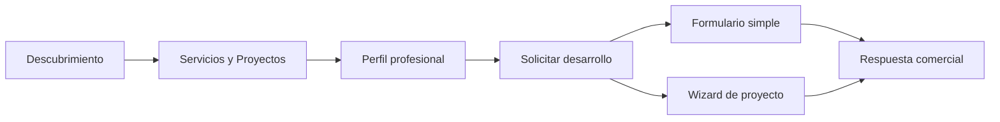

# CYSTEMS Web

<p align="center">
  
</p>

<p align="center">
  
</p>

<p align="center">
  <a href="https://cystems.ec"></a>
  <a href="https://www.linkedin.com/in/cristian-bravodev/"></a>
</p>

<p align="center">
  
  
  
  
  
</p>

## Vision General

**CYSTEMS Web** es el sitio principal de presentacion de la marca CYSTEMS.  
No es solo un landing: combina **sitio corporativo**, **portafolio**, **perfil profesional**, **blog base** y un **flujo de conversion** para solicitudes de desarrollo.

El proyecto esta construido para comunicar tres ideas con claridad:

- CYSTEMS disena, desarrolla y opera soluciones digitales para empresas.
- La experiencia visual importa tanto como la arquitectura tecnica.
- El sitio debe convertirse en una herramienta real de captacion, no solo en una vitrina.

## Que Incluye

### Experiencia publica del sitio

- `Home` con narrativa de valor, servicios, metodo y CTA principal.
- `Servicios` con modales y mensajes orientados a consultoria, plataformas y operacion.
- `Proyectos` como vitrina con storytelling visual y referencias publicas/privadas.
- `Perfil` como pagina extendida de Cristian Bravo con foco en criterio tecnico, identidad y acompanamiento.
- `Blog` preparado para publicaciones tecnicas.

### Conversion y contacto

- Nueva landing de `/solicitar-desarrollo` con dos rutas de entrada.
- Flujo rapido en `/solicitar-desarrollo/simple`.
- Wizard profesional en `/solicitar-desarrollo/proyecto`.
- Validaciones, progreso, persistencia temporal y estimado automatico en el brief largo.
- La navegacion del sitio ya usa este flujo como punto principal de contacto.

### Sistema visual

- Navbar premium con glass UI, dark mode y estados interactivos.
- Componentes Astro orientados a performance.
- Islas interactivas con Preact solo donde realmente hacen falta.
- Motion con `animejs` y animaciones custom en CSS.
- Contenido centralizado en `src/data` para mantener copy y estructura desacoplados de la vista.

## Mapa del Proyecto

| Area | Objetivo |
| --- | --- |
| `src/pages` | Define rutas publicas del sitio |
| `src/components` | Construye secciones, cards, modales, formularios y piezas compartidas |
| `src/data` | Centraliza textos, metadata y configuraciones de las vistas |
| `src/layouts` | Estructura base, theme handling y comportamiento global |
| `src/styles` | Sistema visual, motion y estilos especificos por pagina |

## Stack

```txt
Astro        -> rendering, routing y performance general
Preact       -> formularios y UI interactiva
Tailwind CSS -> utilidades y layout rapido
Anime.js     -> motion y microinteracciones
PostCSS      -> pipeline de estilos
```

## Flujo de Producto



## Estructura Actual de Rutas

```txt
/
/servicios
/proyectos
/perfil/cristian-bravo
/blog
/blog/[slug]
/solicitar-desarrollo
/solicitar-desarrollo/simple
/solicitar-desarrollo/proyecto
/contacto
```

> Nota: `/contacto` sigue existiendo en el proyecto, pero ya no es el acceso principal desde la UI.

## Principios del Proyecto

- **Contenido guiado por negocio**: cada pagina responde a una etapa del proceso comercial.
- **Frontend con identidad**: no se busca un look generico de plantilla.
- **Motion con criterio**: las animaciones apoyan jerarquia, ritmo y conversion.
- **Arquitectura mantenible**: datos, layouts, paginas y estilos estan separados con intencion.
- **Responsive real**: los flujos importantes fueron pensados para desktop y mobile.

## Como Ejecutarlo

```bash
npm install
npm run dev
```

Build de produccion:

```bash
npm run build
npm run preview
```

## Estructura Base

```txt
src/
  components/
    blog/
    contact/
    development-request/
    home/
    profile/
    projects/
    services/
    shared/
  data/
  layouts/
  pages/
  scripts/
  styles/
```

## Lo Mas Importante de Este Repo

- Presenta la propuesta general de CYSTEMS.
- Demuestra criterio de UI, motion y estructura frontend.
- Funciona como portafolio y como embudo de captacion.
- Sirve como base para seguir sumando contenido tecnico y nuevas rutas comerciales.

## Contacto

- Web: [cystems.ec](https://cystems.ec)
- LinkedIn: [Cristian Bravo](https://www.linkedin.com/in/cristian-bravodev/)
- Email: `contacto@cystems.dev`

---

<p align="center">
  Hecho para mostrar producto, criterio visual y arquitectura en una sola experiencia.
</p>
